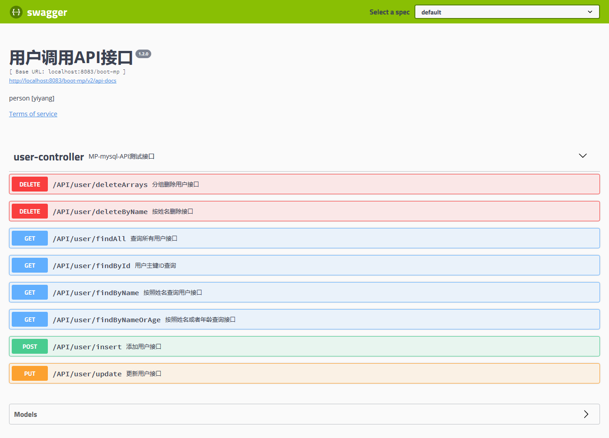
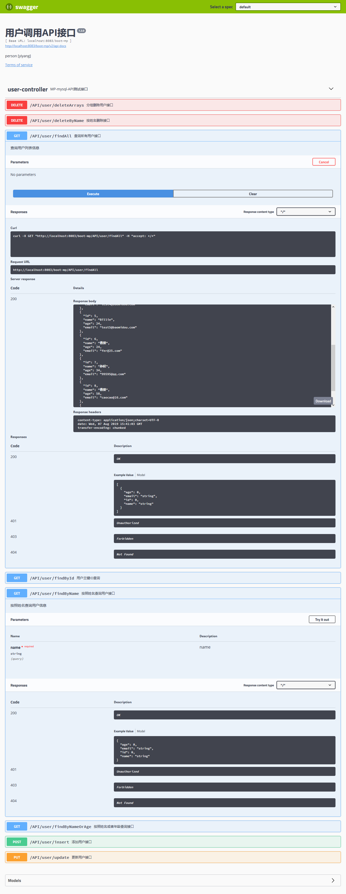

# spring-boots-demo
> 开发一个springboot系列单例

++ spring-boots-demo

|------Springboot-list-jpa

|------Springboot-list-mp

|------Springboot-list-redis

|------Springboot-list-web

|------Springboot

# 整合Swagger 编写API文档

### 1. 添加swagger依赖

```xml
		<dependency>
			<groupId>io.springfox</groupId>
			<artifactId>springfox-swagger2</artifactId>
			<version>2.9.2</version>
		</dependency>
		<dependency>
			<groupId>io.springfox</groupId>
			<artifactId>springfox-swagger-ui</artifactId>
			<version>2.9.2</version>
		</dependency>
```


### 2. 添加java配置

```java
@Configuration
@EnableSwagger2
public class Swapper2Configuration {
	@Bean
    public Docket createRestApi() {
        return new Docket(DocumentationType.SWAGGER_2)
                .apiInfo(apiInfo())
                .select()
                .apis(RequestHandlerSelectors.basePackage("com.boot.mp.controller"))
                .paths(PathSelectors.any())
                .build();
    }
 
    private ApiInfo apiInfo() {
        return new ApiInfoBuilder()
                .title("用户调用API接口")
                .description("person [yiyang]")
                .contact("易阳科技有限公司,http://www.yiyang1234.com")
                .termsOfServiceUrl("http://localhost:8081/")
                .version("1.2.0")
                .build();
         //访问地址：http://localhost:8080/ssm/swagger-ui.html       
    }
	
}
```

### 3. 定义API接口

```java
@RestController
@Api(description="MP-mysql-API测试接口",value="用户API")
@RequestMapping("API/user")
public class UserController {
	@Autowired
	private UserService userService;
	
	@Autowired
    private UserMapper userMapper;
	/**
     * 根据用户主键ID查询用户信息
     * @return  返回用户信息
     */
	@RequestMapping(value="findById",method = RequestMethod.GET)
	@ApiOperation(value="用户主键ID查询",notes="根据用户主键ID查询用户信息")
	public User findById(Long id) {
		User u = userMapper.selectById(id);
		return u;
	}
    //........省略
}
```


### 4. 访问API接口测试数据

访问地址为：http://localhost:8083/boot-mp/swagger-ui.html



​							图1 查看API接口文档



​									图2 查询所有用户

[^下次更新]: 2019-08-07

