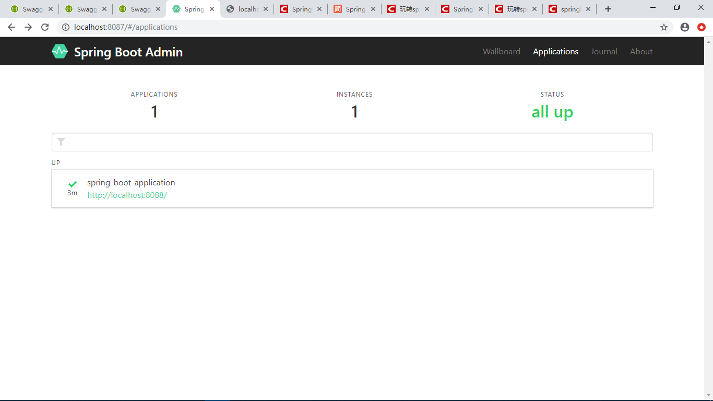

# Spring Boot Admin2.x集成

## 方式一

在 Spring Boot 项目中，Spring Boot Admin 作为 Server 端，其他的要被监控的应用作为 Client 端，基于这种的配置如下步骤：

###1.AdminServer

---------------------
####1.添加依赖AdminServer

```xml
	<dependencies>
        <dependency>
            <groupId>de.codecentric</groupId>
            <artifactId>spring-boot-admin-starter-server</artifactId>
            <version>2.1.3</version>
        </dependency>
        <dependency>
            <groupId>org.springframework.boot</groupId>
            <artifactId>spring-boot-starter-web</artifactId>
        </dependency>
    </dependencies>
```
####2.设置端口号

```propertis
server:
  port: 8087
```
####3. 添加@EnableAdminServer注解

```java
@SpringBootApplication
@EnableAdminServer
```

#### 

###2.AdminClient

--------------------------------------------
####1. 添加AdminClient依赖

```xml
        <dependency>
            <groupId>org.springframework.boot</groupId>
            <artifactId>spring-boot-starter</artifactId>
        </dependency>

        <dependency>
            <groupId>de.codecentric</groupId>
            <artifactId>spring-boot-admin-starter-client</artifactId>
            <version>2.1.0</version>
        </dependency>

        <dependency>
            <groupId>org.springframework.boot</groupId>
            <artifactId>spring-boot-starter-web</artifactId>
        </dependency>

        <dependency>
            <groupId>org.springframework.boot</groupId>
            <artifactId>spring-boot-starter-test</artifactId>
            <scope>test</scope>
        </dependency>
```
####2. 配置属性

```properties
#server.servlet.context-path=/boot-client
server.port=8088

# \u670D\u52A1\u7AEF\u76D1\u63A7\u5730\u5740
spring.boot.admin.client.url=http://localhost:8087
# \u672C\u673AIP
spring.boot.admin.client.instance.service-base-url=http://localhost:8088
# \u5F00\u653E\u76D1\u63A7\u5185\u5BB9
management.endpoints.web.exposure.include=*  
# health/detail \u7EC6\u8282\uFF08\uFF09
management.endpoint.health.show-details = always
```

- `spring.boot.admin.client.url`:要注册的Spring Boot Admin Server的URL
- `management.endpoints.web.exposure.include`：与Spring Boot 2一样，默认情况下，大多数actuator的端口都不会通过http公开，* 代表公开所有这些端点。对于生产环境，应该仔细选择要公开的端点。


>启动两个工程，在浏览器上输入localhost:8087




## 方式二 集成 Eureka

在 Spring Cloud 中基于 Eureka 的 Spring Boot Admin 的搭建：

#### 1.启动Eureka,端口8761

---------------------------------------------------

#### 2.新建 module（springboot-admin）

```xml
<dependency>
    <groupId>de.codecentric</groupId>
    <artifactId>spring-boot-admin-starter-server</artifactId>
    <version>2.0.1-SNAPSHOT</version>
</dependency>
<dependency>
    <groupId>org.springframework.boot</groupId>
    <artifactId>spring-boot-starter-web</artifactId>
</dependency>
<dependency>
    <groupId>org.springframework.boot</groupId>
    <artifactId>spring-boot-starter-security</artifactId>
</dependency>
<dependency>
    <groupId>org.springframework.cloud</groupId>
    <artifactId>spring-cloud-starter-netflix-eureka-client</artifactId>
</dependency>
<dependency>
    <groupId>org.jolokia</groupId>
    <artifactId>jolokia-core</artifactId>
```

#### 3.启动类添加注解

```java
@Configuration
@EnableAutoConfiguration
@EnableAdminServer
@EnableEurekaClient
public class SpringBootAdminApplication {
 
    public static void main(String[] args) {
        SpringApplication.run(SpringBootAdminApplication.class, args);
    }
 
    @Profile("insecure")
    @Configuration
    public static class SecurityPermitAllConfig extends WebSecurityConfigurerAdapter {
        @Override
        protected void configure(HttpSecurity http) throws Exception {
            http.authorizeRequests().anyRequest().permitAll()//
                    .and().csrf().disable();
        }
    }
 
    @Profile("secure")
    @Configuration
    public static class SecuritySecureConfig extends WebSecurityConfigurerAdapter {
        private final String adminContextPath;
 
        public SecuritySecureConfig(AdminServerProperties adminServerProperties) {
            this.adminContextPath = adminServerProperties.getContextPath();
        }
 
        @Override
        protected void configure(HttpSecurity http) throws Exception {
            // @formatter:off
            SavedRequestAwareAuthenticationSuccessHandler successHandler = new SavedRequestAwareAuthenticationSuccessHandler();
            successHandler.setTargetUrlParameter("redirectTo");
 
            http.authorizeRequests()
                    .antMatchers(adminContextPath + "/assets/**").permitAll()
                    .antMatchers(adminContextPath + "/login").permitAll()
                    .anyRequest().authenticated()
                    .and()
                    .formLogin().loginPage(adminContextPath + "/login").successHandler(successHandler).and()
                    .logout().logoutUrl(adminContextPath + "/logout").and()
                    .httpBasic().and()
                    .csrf().disable();
            // @formatter:on
        }
    }
}
```

SecurityPermitAllConfig和SecuritySecureConfig的配置是 Spring Boot Admin 官方给的配置，是对 url 进行安全认证等配置，照着配置即可。@EnableEurekaClient 注解是把 Spring Boot Admin 注册到 Eureka 里，这样 Spring Boot Admin 就可以发现注册到 Eureka 里的其他服务实例，@EnableAdminServer 注解是开启监控功能。

#### 4.配置文件

`resource`目录下新建`bootstrap.yaml`文件：

```yml
spring:
  application:
    name: spring-boot-admin
  profiles:
    active:
      - secure
server:
  port: 8788

# tag::configuration-eureka[]
eureka:   #<1>
  instance:
    leaseRenewalIntervalInSeconds: 10
    health-check-url-path: /actuator/health
  client:
    registryFetchIntervalSeconds: 5
    serviceUrl:
      defaultZone: ${EUREKA_SERVICE_URL:http://localhost:8761}/eureka/

management:
  endpoints:
    web:
      exposure:
        include: "*"  #<2>
  endpoint:
    health:
      show-details: ALWAYS
# end::configuration-eureka[]

---
spring:
  profiles: insecure

---
spring:
  profiles: secure
  security:
    user:
      name: "user"
      password: "password"
  mail:
    host: smtp.163.com
    username: ***@163.com # 用户名
    password: *******
  boot:
    admin:
      notify:
        mail:
          from: ***@163.com # 发件人
          to: ***@qq.com # 收件人
          enabled: true
eureka:
  instance:
    metadata-map:
      user.name: ${spring.security.user.name}        #These two are needed so that the server
      user.password: ${spring.security.user.password} #can access the protected client endpoints
```

#### 5.启动 spring boot admin 服务

此时由于 Eureka 里只有 Spring Boot Admin 自身已注册，所以其监控列表里只有自己，下面我们启动其他的服务，让其注册到 Eureka 里。

#### 6.启动 spring-demo-service 服务

Actuator 在 spring boot 2.0 版本后，只暴露了两个端点，所以此时启动，监控不到所需的信息

```yml
server:
  port: 8281

eureka:
  client:
    serviceUrl:
      # 向每个注册中心注册
      defaultZone: http://localhost:8761/eureka/,http://localhost:8762/eureka/
spring:
  application:
    name: spring-demo-service

management:
  endpoints:
    web:
      exposure:
        include: '*'
  endpoint:
      health:
        show-details: ALWAYS
```

此时启动 spring-demo-service，发现监控列表里 spring-demo-service 已经有了


## 集成邮件通知

#### 1.引入依赖

```
<dependency>
 <groupId>org.springframework.boot</groupId>
 <artifactId>spring-boot-starter-mail</artifactId>
</dependency>
```

#### 2.添加配置

```
spring:
  mail:
    host: smtp.163.com
    username: 18802953162@163.com # 用户名
    password: hao4267364
  boot:
    admin:
      notify:
        mail:
          from: 18802953162@163.com # 发件人
          to: 245682819@qq.com # 收件人
          enabled: true
eureka:spring:
  mail:
    host: smtp.163.com
    username:  ***@163.com # 用户名
    password:  ***
  boot:
    admin:
      notify:
        mail:
          from: ***@163.com # 发件人
          to:  ***@qq.com # 收件人
          enabled: true
eureka:
```

配置后，重启sc-admin-server工程，之后若出现注册的客户端的状态从 UP 变为 OFFLINE 或其他状态，服务端就会自动将电子邮件发送到上面配置的收件地址。


注意 : 配置了邮件通知后，会出现 反复通知 service offline / up。这个问题的原因在于 查询应用程序的状态和信息超时，下面给出两种解决方案：

```
#方法一：增加超时时间（单位:ms）
spring.boot.admin.monitor.read-timeout=20000
#方法二：关闭闭未使用或不重要的检查点
management.health.db.enabled=false
management.health.mail.enabled=false
management.health.redis.enabled=false
management.health.mongo.enabled=false
```

